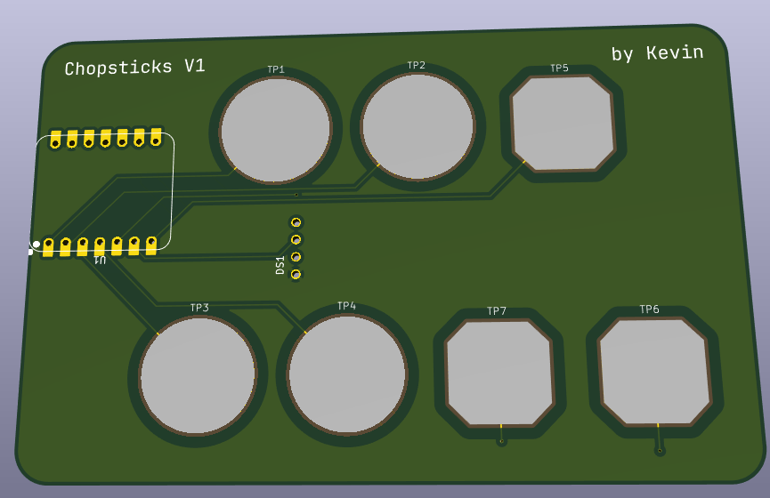
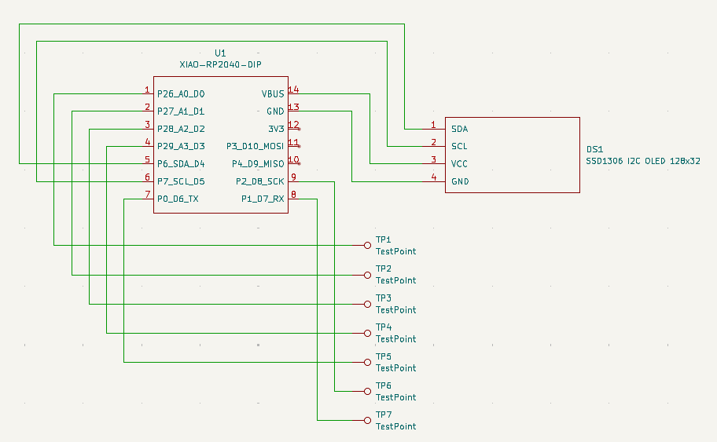
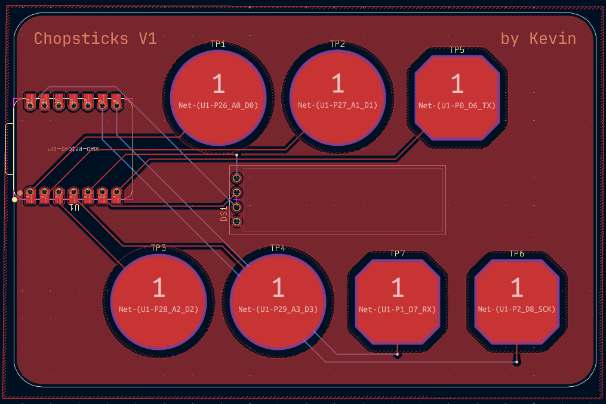

# Chopsticks
A board with a screen and capacitive pads to play the common hand game, chopsticks, with a perfect algorithm! Made for [Hackclub's Blueprint](https://blueprint.hackclub.com/)

## Details
PCB made using KiCAD \
Firmware made using KMK

## About
There was no 3D modelling involved in this project, because I wanted the final outcome to be as minimal as possible. Just a flat PCB with a chip and a screen. I wanted to make a chopsticks AI for a few months, and after making the code for it, I wanted to make a piece of hardware that you could play it with.

## Images

### Schematic

### PCB

## BOM

- 1x [Seeed Studio XIAO RP2040](https://robu.in/product/seeed-studio-xiao-rp2040-v1-0/) (Microcontroller)
- 1x SSD1306 I2C OLED Display (128x32 pixels)
