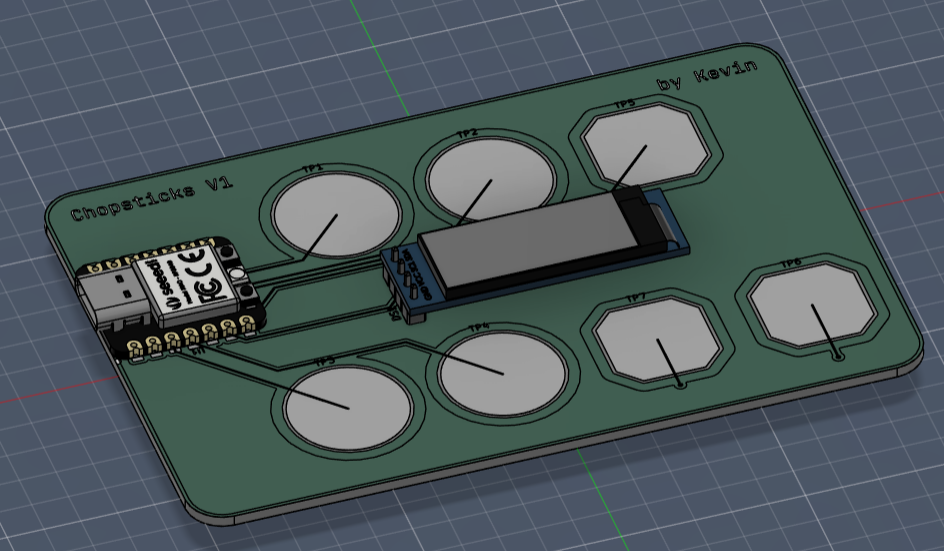
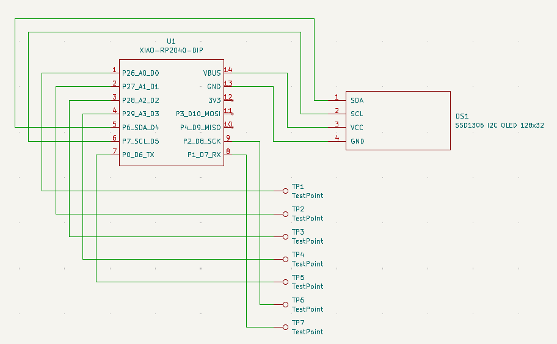
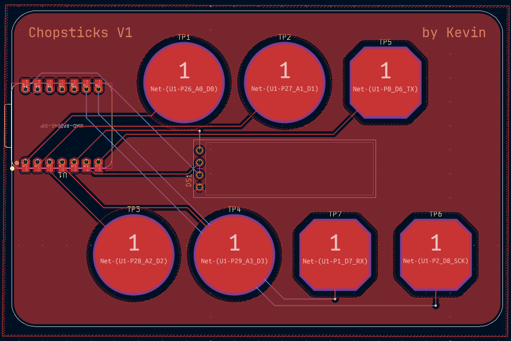
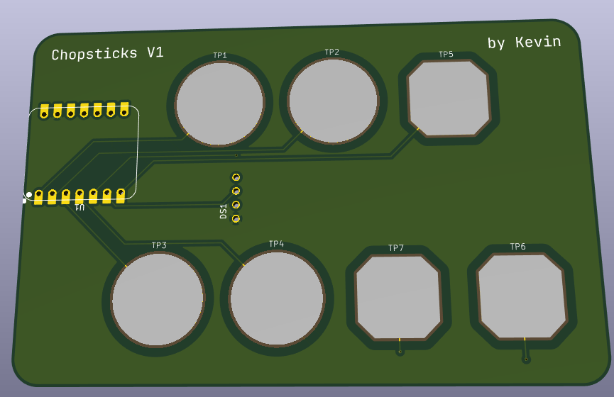

# Chopsticks
A board with a screen and capacitive pads to play the common hand game, chopsticks, with a perfect algorithm! Originally made for [Hackclub's Blueprint](https://blueprint.hackclub.com/)

## Details
PCB made using KiCAD \
Firmware made with CircuitPython

## About
There was no 3D modelling involved in this project, because I wanted the final outcome to be as minimal as possible. Just a flat PCB with a chip and a screen. I wanted to make a chopsticks AI for a few months, and after making the code for it, I wanted to make a piece of hardware that you could play it with.

## Images

### Schematic

### PCB

## BOM
| Item | Description | Quantity | Source | Cost | Amount |
| --- | --- | --- | --- | --- | --- |
| Seeed Studio XIAO RP2040 | Microcontroller | 1 | [Robu](https://robu.in/product/seeed-studio-xiao-rp2040-v1-0/) | ₹529.00 | ₹529.00 |
| SSD1306 I2C OLED Display | 128x32 OLED | 1 | [Robu](https://robu.in/product/0-91-inch-128x32-i2c-iic-serial-blue-oled-lcd-display-module/) | ₹212.00 | ₹212.00 |
| Robu Shipping | Standard Shipping | - | - | - | ₹49.00 |
| **TOTAL** | | | | | ₹790.00 ≈ USD$8.20 |
